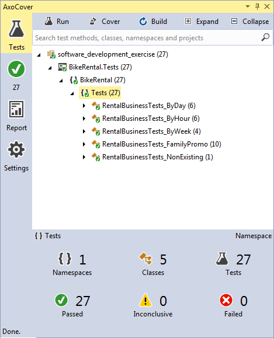
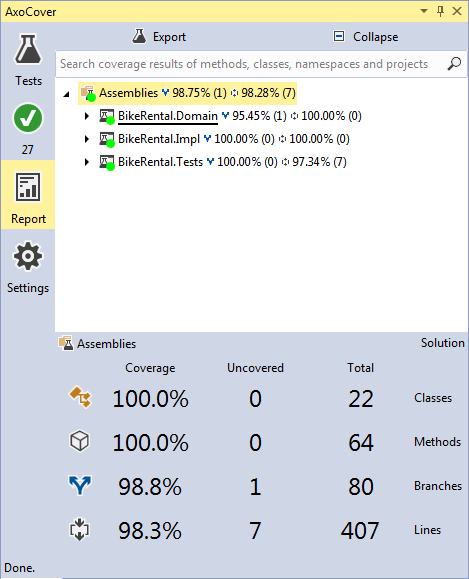

# Software Development Exercise (Bike rental library) #

[](https://ci.appveyor.com/project/DanielAlvarez/software-development-exercise/branch/master) [](https://travis-ci.org/alvarezdaniel/software_development_exercise)

[](https://twitter.com/dalvarez) [](https://gitter.im/dalvarez_github/Lobby)

This repository was implemented as an exercise for Intive-FDV, following the guidelines in this gist:
https://gist.github.com/nicopaez/511f730c68aff7ff651c39223e38763f.js

---

## Used development tools and libraries

- Visual Studio 2015
- NUnit for unit testing
- Stylecop for code analysis
- Axocover for unit test coverage
- Log4net for logging
- Ninject for Dependency Injection

## Design

The exercise is implemented around a rental business interface declared in an Interfaces assembly. This interface is implemented in an Impl assembly, which also contains the inversion of control module used to inject the business dependency while running the library. This way, the application (in this case the unit tests), doesn't reference directly the implementation assembly, making it possible to change business implementation by changing the library, and also the configuration for injected module in app.config file.
The rental domain is implemented completely in a separate assembly, so that it contains all domain classes used by the rental business.
The implemented tests covers all required functionalities: Renting only one bike in three different type (by hour, day or week), and also renting bikes in family promos.

## Used development practices

- Test driven development
- Singleton design pattern
- Factory Method design pattern
- Travis and AppVeyor for Continuous Integration
- StyleCop for analysis code

## How to run the tests

- Open the solution using Visual Studio 2015
- Install NUnit 3 Test Adapter extension (https://github.com/nunit/docs/wiki/Visual-Studio-Test-Adapter)
- Open the following menu item: Test.. Run.. All Tests (Ctrl-R, A)
- For verifying test coverage, I used AxoCover (https://marketplace.visualstudio.com/items?itemName=axodox1.AxoCover)

## NUnit output

```
------ Run test started ------
 NUnit Adapter 3.7.0.0: Test execution started
 Running all tests in C:\git\software_development_exercise\BikeRental.Tests\bin\Debug\BikeRental.Tests.dll
 NUnit3TestExecutor converted 27 of 27 NUnit test cases
 NUnit Adapter 3.7.0.0: Test execution complete
========== Run test finished: 27 run (0:00:18,3110473) ==========
```

## AxoCover Tests result



## AxoCover Coverage report



## StyleCop analysis result

